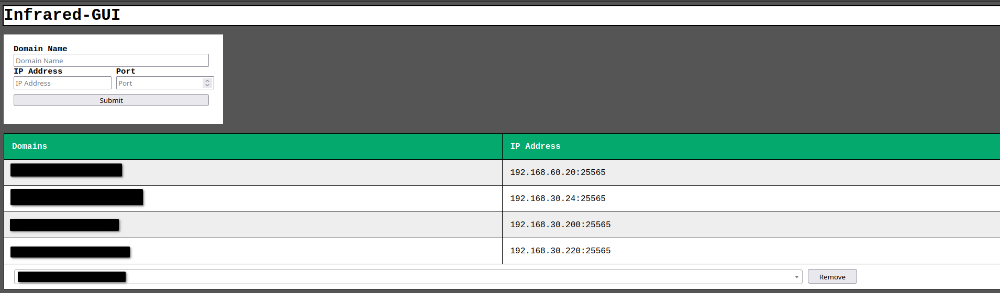

# Infrared-GUI



A ultra Simple GUI built on flask for [infrared](https://github.com/haveachin/infrared)

# Setup 
## Standalone
`touch users.json`

```yml
version: "3"
services:
  infrared-gui:
    image: thedrobe/infrared-gui
    container_name: infrared-gui
    stdin_open: true # docker run -i
    tty: true        # docker run -t
    volumes:
      - ./users.json:/users.json
      - ./Path/to/infrared/configs/:/infrared/data/configs/
    ports:
      - 5000:5000
    restart: unless-stopped
```
`docker compose up -d --force-recreate`

`docker exec -i containername python3 createuser.py`

`docker restart containername`

Now head over to http://IPaddress:5000 and login with the user that you created

You now can go ahead and start making rules to route traffic to servers

## SameStack (MACVLANS)
```yml
version: '3'

services:
  infrared:
    image: ghcr.io/haveachin/infrared:1.3.4
    container_name: infrared
    restart: unless-stopped
    stdin_open: true
    tty: true
    ports:
      - "25565:25565/tcp"
    volumes:
      - "./data/configs:/configs"
   # expose:
    #  - "25565"
    environment:
      INFRARED_CONFIG_PATH: "/configs"
    networks:
      infarared_net:
        ipv4_address: 192.168.30.20

  infrared-gui:
    image: thedrobe/infrared-gui
    container_name: infrared-gui
    stdin_open: true # docker run -i
    tty: true        # docker run -t
    volumes:
      - ./users.json:/users.json
      - ./data/configs/:/infrared/data/configs/
    #ports:
    #  - 5000:5000
    networks:
      infarared_net:
        ipv4_address: 192.168.30.21
    restart: unless-stopped

networks:
  infarared_net:
    name: infarared_net
    driver: macvlan
    driver_opts:
      parent: eth1
    ipam:
      config:
        - subnet: "192.168.30.0/24"
          gateway: "192.168.30.1"
```

## Commands to Know
1. `docker exec -i containername python3 createuser.py` Will need to restart container for changes to take effect
2. `docker exec -i containername python3 deleteuser.py` Will need to restart container for changes to take effect